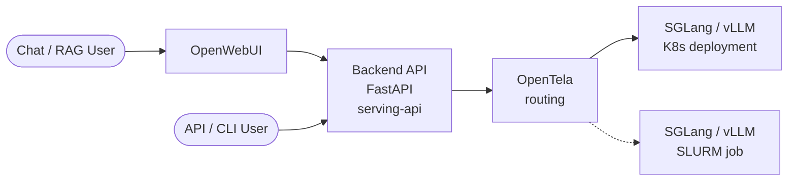
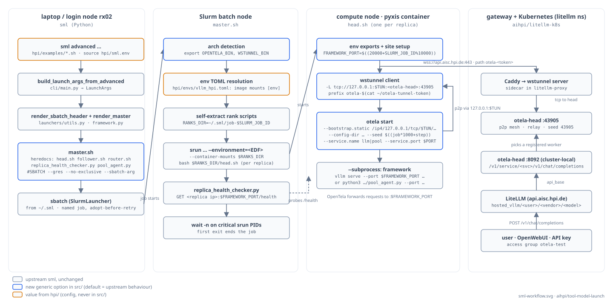

# Architecture

SML is a thin orchestrator. It doesn't serve models itself — it submits SLURM jobs that bring up an inference framework (sglang or vLLM) on cluster nodes, optionally fronted by a router for load balancing.

## Request flow at a glance

A user request reaches a model the same way whether the model lives on Kubernetes or in a SLURM job. OpenTela picks whichever backend has the model registered.



**K8s** = always-on deployment, managed separately. **SLURM** = what SML provisions, time-limited. From the API's and user's perspective, the two are interchangeable — that's what OpenTela buys you.

## Launch workflow



Left to right:

- **Login node**: `sml advanced` is parsed into a `LaunchArgs`; `render_sbatch_header` and `render_master` turn it into one `master.sh` that embeds every rank script (`head.sh`, `follower.sh`, `router.sh`, the replica health checker and the pool agent) as heredocs, and the launcher submits it with `sbatch` from `~/.sml`.
- **Batch node**: `master.sh` detects the architecture (`OPENTELA_BIN`, `WSTUNNEL_BIN`), resolves the env TOML, self-extracts the rank scripts into `~/.sml/job-<id>`, starts one `srun --environment=<EDF>` per replica, probes each replica's `/health`, and ends the job when the first critical step exits.
- **Compute node (container)**: `head.sh` derives the framework port (fixed `8080`, or per job with `--framework-port auto`), optionally opens a wstunnel to a bootstrap peer that is not directly routable, and runs `otela start` with a deterministic identity and a private bootstrap list around the framework process.
- **Gateway / Kubernetes**: the tunnel ends at the OpenTela head, which registers the worker; LiteLLM's rows point at the head's HTTP API (`/v1/service/<svc>/v1`), and users reach the model through LiteLLM.

Outline colours mark what is upstream sml, what is a new generic option in `src/` (default = upstream behaviour) and what is site configuration under `hpi/`.

## Components

```text
┌──────────┐    ┌──────────────┐    ┌─────────────────────┐
│  user    │ ─► │  sml CLI     │ ─► │  FirecREST / SLURM  │
│  / MCP   │    │  (this repo) │    │  job submission     │
└──────────┘    └──────────────┘    └──────────┬──────────┘
                                               │
                                  ┌────────────▼─────────────┐
                                  │   SLURM job (per launch) │
                                  │  ┌──────────────────────┐│
                                  │  │ router (optional)    ││
                                  │  └─────────┬────────────┘│
                                  │  ┌─────────▼────────────┐│
                                  │  │ N replicas           ││
                                  │  │  ┌──────────┐         ││
                                  │  │  │ sglang / │         ││
                                  │  │  │ vLLM     │         ││
                                  │  │  └────┬─────┘         ││
                                  │  └───────┼───────────────┘│
                                  │  ┌───────┼───────────────┐│
                                  │  │ DCGM + vmagent        ││
                                  │  └────┬──┼───────────────┘│
                                  └───────┼──┼────────────────┘
                                          │  │
                                          │  └──► OpenTela p2p mesh ◄── serving-api
                                          │                              (public gateway)
                                          │
                                          └──► metrics backend ──► Grafana
```

Two independent planes leave the job:

- **Request plane** (right): each replica registers itself on the **OpenTela p2p mesh** at startup. The serving-api gateway resolves model names through OpenTela and forwards requests to a registered peer. Skip the registration with `--disable-opentela` (see below).
- **Metrics plane** (bottom): DCGM and vmagent scrape per-GPU and per-process metrics and ship them via remote-write to the metrics backend (a Prometheus-compatible endpoint, `prometheus-dev.swissai.svc.cscs.ch/api/v1/write`), which Grafana reads from. This is distinct from the launch-telemetry endpoint (`sml-dev.swissai.svc.cscs.ch/launches`), which only receives a one-time launch-metadata POST and carries no metrics. Separate system; not OpenTela.

## Site-specific options

Everything cluster-specific is a flag or an environment variable whose default is the CSCS behaviour, so another site needs configuration rather than code:

| Option | Default | Purpose |
| --- | --- | --- |
| `--gres`, `--cpus-per-task`, `--mem`, `--no-exclusive`, `--sbatch-arg=…` | whole exclusive nodes, no resource requests | shared-node clusters |
| `--framework-port auto` | `8080` | one port per job derived from `SLURM_JOB_ID` when nodes are shared |
| `--tunnel-url`, `--tunnel-token-file`, `--tunnel-target` | none | wstunnel to an OpenTela head that is not directly routable; a bare peer ID in `--opentela-bootstrap-addr` is reached through it |
| `--opentela-service-name` | `llm` | service a job advertises; the [GPU pool](gpu-pool.md) uses `pool` |
| `SML_OPENTELA_BOOTSTRAP_ADDR` | prod peer | default for `--opentela-bootstrap-addr` |
| `SML_TELEMETRY_ENDPOINT` | CSCS sink | launch-telemetry sink; empty disables |
| `SML_HEALTH_CHECK_URL`, `SML_HEALTH_MODEL_PREFIX` | CSCS gateway, no prefix | where the health panel probes and how the gateway names the model |

Every OpenTela peer also gets `--bootstrap.static` (only our head, never the public bootstrap list), a per-step `--config-dir` and a deterministic `--seed`, so replicas on a shared home are distinct peers.

## Repos in the serving stack

SML is one piece of a larger system. The siblings:

- **[swiss-ai/model-launch](https://github.com/swiss-ai/model-launch)** — this repo. The CLI and MCP server.
- **[swiss-ai/serving-api](https://github.com/swiss-ai/serving-api)** — the public-facing inference gateway at [serving.swissai.svc.cscs.ch](https://serving.swissai.svc.cscs.ch/). Resolves model names against OpenTela and forwards requests to a registered peer.
- **[swiss-ai/opentela](https://github.com/swiss-ai/opentela)** — the **p2p service mesh** that connects models regardless of where they live (SLURM job, Kubernetes pod, any network or location). Each replica registers itself on the mesh at startup, under the served model name. By default OpenTela does **random assignment among peers** registered under the same name — that's the load-balancing primitive. OpenTela is what makes a model launched here on Clariden interchangeable, from the gateway's perspective, with the same model running in a k8s deployment elsewhere.

## Request path (typical SML deployment)

1. User runs `sml advanced ...` (or interactive `sml`).
2. SML serializes launch args, builds an `sbatch` script, submits via FirecREST or directly via SLURM.
3. SLURM allocates nodes; the job script starts the inference framework on each replica.
4. Each replica registers itself on the OpenTela p2p mesh under the served model name (unless `--disable-opentela` was passed).
5. (Optional) `--router sglang` puts a framework router (e.g. sglang-router) in front of the replicas inside the job (the default `--router opentela` lets OpenTela balance across the replica peers instead). The in-job router shapes traffic *within* the job; OpenTela picks *which* job/peer a request lands on.
6. DCGM exporter and vmagent start in sidecar fashion on each replica node, remote-writing metrics to the Prometheus-compatible metrics backend (distinct from the launch-telemetry endpoint).
7. A user request hits serving-api → serving-api uses OpenTela to look up the model name and pick a registered peer → the request flows through the OpenTela mesh to that peer, where the peer's local OpenTela layer hands it off to the framework process.

## Disabling OpenTela registration: `--disable-opentela`

By default each replica joins the OpenTela mesh at startup. Pass `--disable-opentela` to skip the registration. The framework still runs and serves on its replica port inside the cluster, but it never joins the mesh — so:

- It is **not reachable through [serving-api](https://github.com/swiss-ai/serving-api)** at [serving.swissai.svc.cscs.ch](https://serving.swissai.svc.cscs.ch/).
- It is only reachable directly via host:port from another job on the same cluster.

Use `--disable-opentela` for private models, raw-throughput benchmarks (no OpenTela hop), or when you've stood up your own routing in front of the replicas. See [usage-advanced.md](usage-advanced.md#when-to-disable-opentela).

> The OpenTela client binary ships on-disk as `otela-<arch>` and is referenced via the `OPENTELA_BIN` env var.

## Where SML's responsibility ends

SML's job is "get the framework process running on the right nodes with the right args, and stream you the logs until it's healthy." It does not:

- Persist the deployment past the SLURM time limit (use k8s for that — see [FAQ](faq.md#i-want-to-keep-a-model-running-247-can-sml-do-that)).
- Route public traffic (that's serving-api + OpenTela).

This separation keeps SML small enough that a single user can read the whole codebase in an afternoon.

## Next

- [How to size a model](sizing.md) — picking the layout the architecture above will materialize
- [MCP](mcp.md) — driving the same orchestrator from an LLM client
