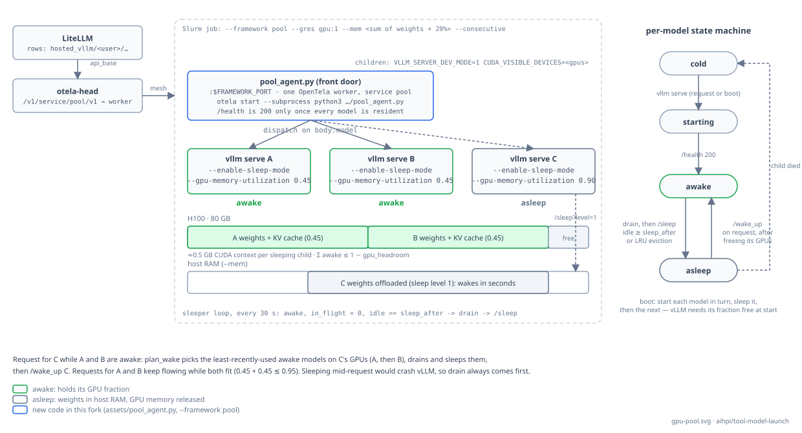

# GPU pool (`--framework pool`)

One long-lived Slurm job holds a GPU (or several) and serves **many models** from it. Every model in the pool's catalog is loaded once at start and then put to **sleep** with vLLM's sleep mode: its weights move to host RAM and its GPU memory is released. A request for a model wakes it in seconds; models that go idle fall asleep again; when the requested model does not fit next to the awake ones, the least-recently-used awake models are put to sleep first.

Use it when you have more models than GPUs and their use is sporadic. Use one job per model (`--framework vllm|sglang`) when a model is busy around the clock or needs more than one node.



## How it works

The framework process of the job is [`pool_agent.py`](https://github.com/aihpi/tool-model-launch/blob/hpi/src/swiss_ai_model_launch/assets/pool_agent.py). sml materialises it into `$RANKS_DIR` next to the rank scripts and starts it on the job's framework port, wrapped by OpenTela like any other framework, so the whole pool is **one OpenTela worker**. The agent:

1. **Boots** every catalog model in turn: start `vllm serve … --enable-sleep-mode --gpu-memory-utilization <fraction>`, wait for `/health`, then `POST /sleep?level=1`. Models start one at a time because vLLM insists that its memory fraction is *free* when it starts. `/health` on the front door returns `200` only once this is done, so sml's health checker (and a consecutive-chain handover) never treats a half-booted pool as healthy.
2. **Dispatches** each `/v1/*` request by the `model` field of its JSON body to the matching child, streaming the response through unchanged (SSE included). Unknown models get a `404` listing the catalog.
3. **Wakes** the model if it is asleep: `plan_wake` picks, per GPU the model spans, the awake models with the oldest `last_used` until the sum of `gpu_fraction`s fits under `1 − gpu_headroom`, **drains** them (waits for their in-flight requests), puts them to sleep, then `POST /wake_up` on the target. Sleeping a model mid-request crashes vLLM with a CUDA error, so draining always comes first.
4. **Sleeps** awake models that have had no request for `sleep_after` (checked every 30 s).
5. **Restarts** a child that died on its next request (it is treated as cold again).

Every LiteLLM row of a pool model points at the same `api_base`, `…/v1/service/pool/v1`. The OpenTela head sees one `pool` service and forwards requests to the pool; the pool does the per-model routing. That is why the pool registers under `--opentela-service-name pool` instead of `llm`.

## Configuration

```toml title="hpi/pool.toml"
sleep_after = "5m"     # awake and idle this long → back to sleep
sleep_level = 1        # weights → host RAM (only level 1 is supported)
gpu_headroom = 0.05    # Σ gpu_fraction of awake models per GPU ≤ 1 − headroom
drain_timeout = "10m"  # max wait for in-flight requests before sleeping a model
start_timeout = "30m"  # max wait for a fresh vLLM process to become healthy

[[models]]
served_name = "alice/Qwen/Qwen3-8B"   # what LiteLLM sends as `model` (no hosted_vllm/ prefix)
model = "Qwen/Qwen3-8B"               # what `vllm serve` loads; defaults to served_name
gpus = [0]                            # CUDA_VISIBLE_DEVICES; len == --tensor-parallel-size
gpu_fraction = 0.45                   # --gpu-memory-utilization
args = "--max-model-len 32768"        # extra vllm serve arguments
```

| Key | Meaning |
| --- | --- |
| `sleep_after` | Idle time after which an awake model is put to sleep. Durations accept `s`, `m`, `h`. |
| `sleep_level` | vLLM sleep level. Level 1 keeps weights in host RAM and wakes in ~0.3 s (0.6B) to ~5 s (200B+). Level 2 would discard the weights too but needs a weight reload after waking; not supported yet. |
| `gpu_headroom` | Fraction of each GPU kept free; sleeping children still hold a CUDA context (~0.5 GB each). |
| `drain_timeout` | How long an eviction waits for a busy model's requests to finish. On timeout the requester gets a `503` with `Retry-After`. |
| `start_timeout` | How long a fresh `vllm serve` may take to become healthy. |
| `models[].served_name` | Must equal the `model` LiteLLM sends: the sml-namespaced `<user>/<vendor>/<model>`. |
| `models[].gpus` | GPU indices inside the job. A model spanning several GPUs uses tensor parallelism across them. |
| `models[].gpu_fraction` | Memory fraction the model reserves while awake. Two models at `0.45` share a GPU; one at `0.9` needs it alone. |

## Sizing the job

- `--gres gpu:N` for the GPUs the catalog spans.
- `--mem` ≥ the sum of all model weights (level-1 sleepers live in host RAM) + 20 %.
- `--time` the partition's maximum, plus `--consecutive` so the pool is replaced before it expires; the successor boots its catalog while the old pool still serves.
- `--framework-args "--config <path visible inside the container>"`; sml injects `--port` itself.

```bash title="hpi/examples/pool.sh (abridged)"
sml advanced --framework pool --environment hpi/envs/vllm_hpi.toml \
  --served-model-name pool --opentela-service-name pool \
  --gres gpu:1 --no-exclusive --mem 100G --framework-port auto \
  --tunnel-url wss://api.aisc.hpi.de:443 --tunnel-token-file ~/otela-tunnel-token \
  --tunnel-target otela-head.litellm.svc.cluster.local:43905 \
  --framework-args "--config ~/tool-model-launch/hpi/pool.toml"
```

## Registering the models

One LiteLLM row per catalog model, all with the pool's `api_base`; the row's `model` is `hosted_vllm/<served_name>`. Set the row `timeout` above the worst case you accept: waking takes seconds, but a child that died is restarted on demand and that takes minutes.

## Limitations

- One node per pool job (several pool jobs can run side by side; the head balances between them only if they carry the same catalog).
- vLLM only. SGLang's `/release_memory_occupation` / `/resume_memory_occupation` would fit the same state machine.
- No eviction to *cold* on host-RAM pressure: size `--mem` for the whole catalog.
- One global lock serialises state transitions; a cold start blocks other transitions (not requests to awake models) for its duration.

See [ADR-0002](adrs/0002-gpu-pool-sleep-mode.md) for why this shape was chosen over a per-model scheduler.
